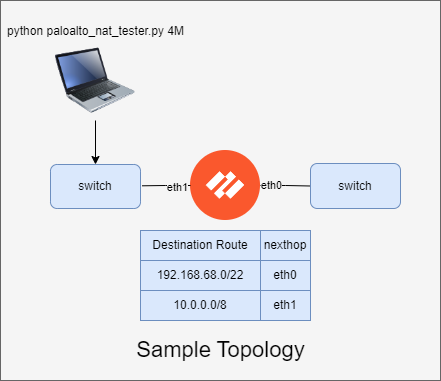

# UDP Session Generator for Palo Alto NAT Testing


This Python script generates UDP sessions to test Palo Alto NAT oversubscription and memory. It simulates various scenarios by creating and closing UDP sockets at a high rate, using different source IP addresses and mimicking common protocols like NTP and DNS.

# WARNING!!!

This script generates a large number of sockets per second on your system. This may cause system instability or possible network impact when running. Make sure you only run this script in a controlled LAB environment. Use it responsibly and only on networks and systems you have permission to test. Misuse of this script could potentially cause network disruptions or trigger security alerts.

## Features

- Generates UDP packets mimicking NTP and DNS protocols
- Uses raw sockets with custom IP headers
- Creates and closes sockets rapidly using different source IP addresses
- Implements multi-threading for improved performance
- Supports three testing scenarios: 65K, 512K, and 4M concurrent sessions
- Allows custom destination IP or subnet configuration
- Optimized for rapid socket creation and closure

## Requirements

- Python 3.6 or higher
- Palo Alto firewall in a LAB environment configured with:
    - 1 interface that routes 192.168.68.0/22 towards next-hop
    - 1 interface that the system running this script connects through
    - Security policy allows all traffic
    - Strict source routing is disabled
    - NAT Policy configured properly for each scenario
    - Sufficient hardware/software capacity to handle up to 4 million sessions

## Installation

1. Clone this repository or download the paloalto_nat_tester.py file.
2. Ensure you have Python 3.6 or higher installed on your system.
3. Connect your system to a lab network with a Palo Alto firewall (or other firewall product for testing).
4. Triple check you aren't connected to any production networks across your wifi/lan. 

## Usage

Run the script from the command line with the following syntax:

```
python3 paloalto_nat_tester.py <scenario> [--dst_ip <ip>] [--dst_subnet <subnet>]
```

### Usage Examples

1. Generate 65K concurrent sessions to a specific IP:
   ```
   python3 paloalto_nat_tester.py 65K --dst_ip 192.168.1.1
   ```

2. Generate 512K concurrent sessions to a subnet:
   ```
   python3 paloalto_nat_tester.py 512K --dst_subnet 192.168.0.0/24
   ```

3. Generate 4M concurrent sessions using the default subnet:
   ```
   python3 paloalto_nat_tester.py 4M
   ```

### Arguments

- `<scenario>`: Choose from "65K", "512K", or "4M"
- `--dst_ip`: (Optional) Specify a destination IP for the 65K scenario
- `--dst_subnet`: (Optional) Specify a destination subnet for the 512K and 4M scenarios

## Scenarios

1. 65K concurrent sessions per single destination IP
   - Default destination IP: 192.168.69.69
   - Requires Palo Alto NAT source-translation to a single IP

2. 512K concurrent sessions per single NAT IP
   - Default destination subnet: 192.168.68.0/22
   - Requires Palo Alto NAT source-translation to a single IP

3. 4 million concurrent sessions per /29 NAT Pool
   - Default destination subnet: 192.168.64.0/18
   - Requires Palo Alto NAT source-translation to a NAT Pool /29

## Performance

The script is optimized for rapid socket creation and closure. Actual performance may vary depending on your system's capabilities. Here are some example results:

- 65K scenario:
  ```
  Generating 65000 sessions at a rate of 10000 sessions/second
  Estimated time: 6.50 seconds
  Actual time taken: 6.51 seconds
  ```

- 512K scenario:
  ```
  Generating 512000 sessions at a rate of 10000 sessions/second
  Estimated time: 51.20 seconds
  Actual time taken: 68.96 seconds
  ```

## Customization

You can modify the script to adjust the rate of socket creation/closure, change the source IP range, or alter the protocols being simulated. The script uses a ThreadPoolExecutor with a maximum of 1000 workers or the specified rate, whichever is smaller, to manage concurrent socket operations.

## Contributing

Contributions to improve the script are welcome. Please submit pull requests or open issues to suggest enhancements or report bugs.

# Caution

This tool is for educational and testing purposes only. Improper use may lead to network disruptions or trigger security alerts. Use only in authorized, controlled environments. The author is not responsible for any misuse or damage caused by this tool.

## License

This project is licensed under the MIT License